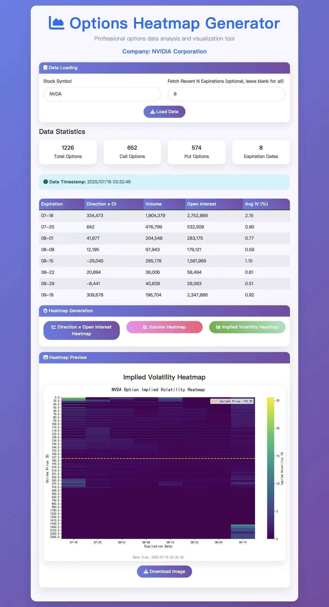
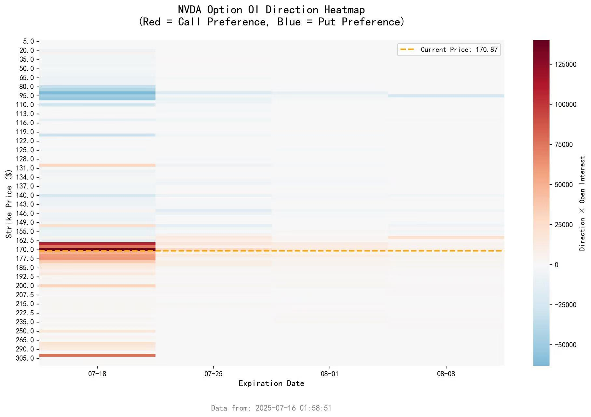

# Options Heatmap Analysis Tool

语言 / Language: 简体中文 | [English](./README_EN.md)

[](./.python-version)
[](https://flask.palletsprojects.com/)
[](https://docs.astral.sh/uv/)
[](./LICENSE)

一个面向期权链研究与可视化展示的轻量级 Web 应用。项目基于 [Flask](https://flask.palletsprojects.com/) 构建，以 [Finnhub](https://finnhub.io/docs/api) 作为数据源，将期权链抓取、标准化快照、统计汇总与热力图渲染串成一条完整分析链路，适合作为量化分析 Demo、作品集项目和二次开发起点。

## 目录

- [项目亮点](#项目亮点)
- [界面预览](#界面预览)
- [快速开始](#快速开始)
- [配置说明](#配置说明)
- [使用方式](#使用方式)
- [API 接口](#api-接口)
- [常见问题](#常见问题)
- [开发与测试](#开发与测试)
- [项目结构](#项目结构)

## 项目亮点

- 端到端打通期权数据获取、标准化落盘、汇总统计与热力图渲染，开箱即可演示完整分析流程
- 使用官方 [`finnhub-python`](https://github.com/Finnhub-Stock-API/finnhub-python) 客户端获取期权链、现价和公司资料，数据来源清晰可追溯
- 支持三种核心视图：
  - `Direction × Open Interest`
  - `Volume`
  - `Implied Volatility`
- 图表内置当前价格参考线与数据时间戳，更适合快速观察期权结构和近端到期分布
- 自动生成本地 JSON / CSV 快照，便于调试、复盘和后续分析
- 提供轻量 Flask Web 界面与 API，适合快速展示，也方便继续扩展
- 对权限不足、网络异常、空数据等情况返回明确错误，避免静默失败
- 测试覆盖数据抓取、标准化、文件落盘、API 路径和热力图生成等核心流程

## 界面预览

### 主界面



### 热力图示例



## 快速开始

### 1. 克隆项目

```bash
git clone https://github.com/hyphy-void/Options_Heatmap_Analysis_Tool
cd Options_Heatmap_Analysis_Tool
```

### 2. 配置 API Key

```bash
export FINNHUB_API_KEY="your_finnhub_key"
```

### 3. 安装依赖

```bash
uv sync
```

### 4. 启动服务

```bash
uv run python app.py
```

如果 `5000` 端口已被占用：

```bash
PORT=5001 uv run python app.py
```

启动后访问：

- 默认地址：[http://localhost:5000](http://localhost:5000)
- 自定义端口示例：[http://localhost:5001](http://localhost:5001)

## 配置说明

### 必需环境变量

| 变量名 | 必需 | 说明 |
| --- | --- | --- |
| `FINNHUB_API_KEY` | 是 | Finnhub API Key |

### 可选环境变量

| 变量名 | 默认值 | 说明 |
| --- | --- | --- |
| `PORT` | `5000` | Flask 启动端口 |
| `HOST` | `0.0.0.0` | Flask 监听地址 |
| `FLASK_DEBUG` | `true` | 是否启用调试模式 |

## 使用方式

### Web 界面

1. 启动 Flask 服务
2. 打开浏览器进入首页
3. 输入股票代码，例如 `AAPL`、`TSLA`
4. 选择抓取最近 N 个到期日的数据
5. 点击加载数据并生成热力图
6. 在三类热力图之间切换查看不同维度的市场分布

### 命令行获取数据

获取指定股票最近几个到期日的期权数据：

```bash
uv run python utils_option.py fetch AAPL 4
```

执行后会在 `data/` 目录生成：

- `{SYMBOL}_options_data.json`
- `{SYMBOL}_options_data.csv`

## API 接口

### `GET /`

返回主页面。

### `POST /api/load_data`

获取、标准化并加载指定股票的期权数据。

请求示例：

```json
{
  "symbol": "AAPL",
  "max_expirations": 4
}
```

### `POST /api/generate_heatmap`

基于当前已加载数据生成热力图。

支持的 `chart_type`：

- `direction_oi`
- `volume`
- `iv`

### `GET /api/available_symbols`

返回本地缓存过的股票代码列表。

### `GET /health`

健康检查接口。

## 常见问题

### 1. `Port 5000 is in use`

本机已有其他程序占用了 `5000` 端口。可直接切换端口启动：

```bash
PORT=5001 uv run python app.py
```

### 2. `FINNHUB_API_KEY is not configured`

说明当前 shell 会话没有配置 API Key。请先执行：

```bash
export FINNHUB_API_KEY="your_finnhub_key"
```

### 3. `Finnhub option-chain endpoint forbidden ...`

如果：

- `quote('AAPL')` 可用
- `company_profile2('AAPL')` 可用
- `option_chain('AAPL')` 返回 `403`

通常表示当前 Finnhub Key 没有 `option-chain` endpoint 的访问权限，属于 Finnhub 套餐或 entitlement 限制，而不是本项目仍在使用旧数据链路。

### 4. 页面提示 Finnhub HTML 错误页或网络错误

常见原因：

- Finnhub 端点临时异常
- 本机 DNS / 网络访问异常
- API Key 权限不足

## 开发与测试

### 运行测试

```bash
uv run pytest -q
```

### 代码约定

- 统一使用 `uv` 管理依赖
- 期权数据通过 `finnhub_provider.py` 获取并标准化
- Web 层尽量保持轻量，业务逻辑放在工具层
- 本地快照既用于热力图生成，也方便问题排查和结果复盘

## 项目结构

```text
Options_Heatmap_Analysis_Tool/
├── app.py                  # Flask Web 服务
├── finnhub_provider.py     # Finnhub 数据获取与错误处理
├── utils_option.py         # 数据标准化、落盘、热力图处理
├── templates/
│   └── index.html          # 前端页面
├── assets/                 # README 预览图
├── tests/                  # 测试用例
├── pyproject.toml          # 项目依赖定义
├── uv.lock                 # uv 锁文件
└── LICENSE
```

## License

本项目基于 [MIT License](./LICENSE) 开源。
